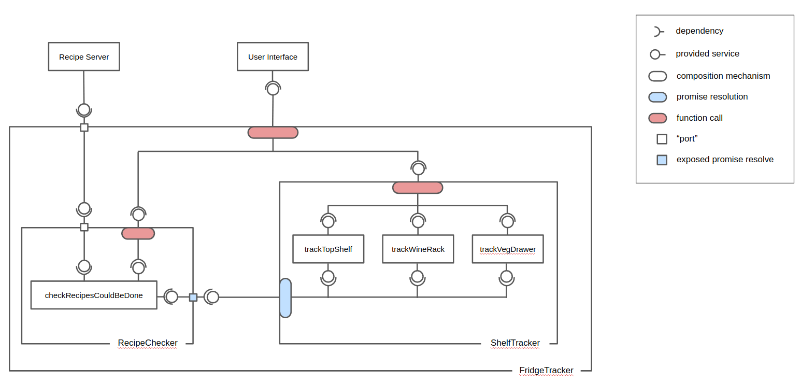

# Fridge Tracker

Component Based Design for tracking ingredients in a fridge and the recipes that could be cooked with them.

### Scenario

We would like to track the ingredients in a fridge and notify the user when their ingredients can be used to cook recipes from a given list.


Each shelf has a sensor that tracks what is placed on it. The position and configuration of each sensor makes it look for different things when tracking items in the fridge (i.e. the code of the door shelf sensor will be different from the code of the sensors for the top shelf, fruit & veg drawer, wine rack etc.)

### Architecture



### Developing steps
```
1. npm run build
2. npm run dev

